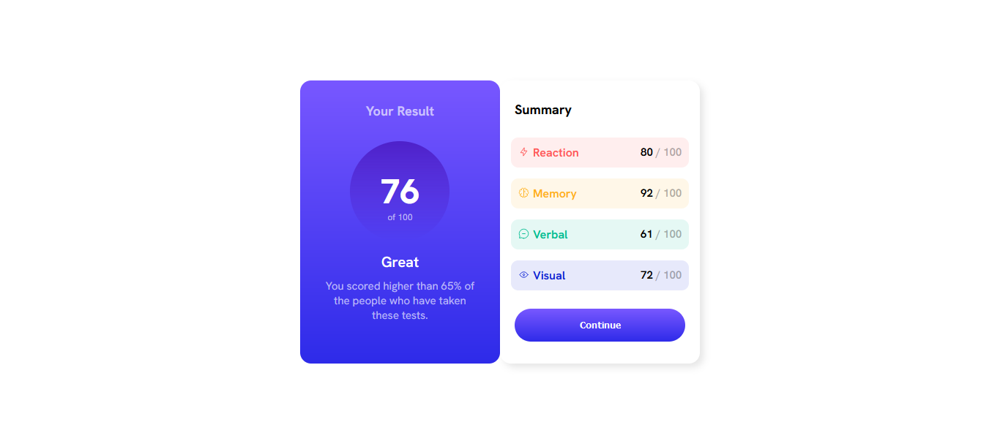
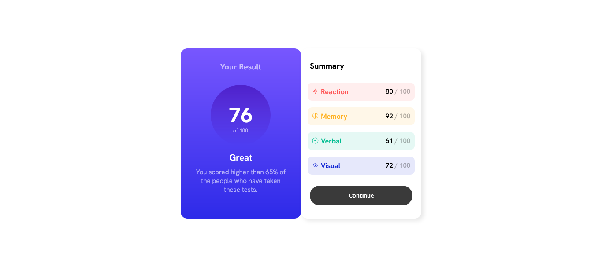
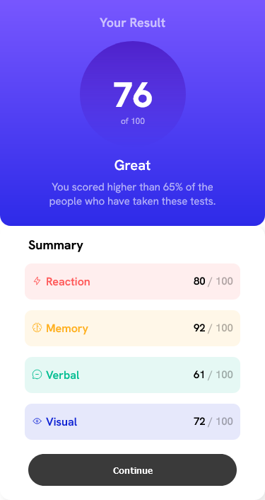

# Frontend Mentor - Results summary component solution

This is a solution to the [Results summary component challenge on Frontend Mentor](https://www.frontendmentor.io/challenges/results-summary-component-CE_K6s0maV). Frontend Mentor challenges help you improve your coding skills by building realistic projects. 

## Table of contents

- [Overview](#overview)
  - [The challenge](#the-challenge)
  - [Screenshot](#screenshot)
  - [Links](#links)
- [My process](#my-process)
  - [Built with](#built-with)
  - [What I learned](#what-i-learned)
  - [Continued development](#continued-development)
  - [Useful resources](#useful-resources)
- [Author](#author)

## Overview

### The challenge

Users should be able to:

- View the optimal layout for the interface depending on their device's screen size
- See hover and focus states for all interactive elements on the page

### Screenshot

### Links

- Solution URL: [Github Repo](https://github.com/bobo-m/results-summary--Frontend-Mentor)
- Live Site URL: [Live Site](https://bobo-m.github.io/results-summary--Frontend-Mentor/)

## My process

### Built with

- Semantic HTML5 markup
- CSS custom properties
- Flexbox
- Mobile-first workflow

### What I learned
I learned how to better use flexbox and table implementation and incresing space between table rows.

### Continued development
The code is bulky without the use of variables. I would revisit this project to change some some implementations to reduce the code size and add the marks dynamically from the data.json file.

### Useful resources

- [MDN Web Docs](https://developer.mozilla.org/en-US/docs/Web/CSS) - This helped me for reading html tag and css properties documentation. 
- [Stack Overflow](https://stackoverflow.com/) - This is an amazing page to clear most of my doubts while coding.

## Author

- [Bob Anugrah Murmu]
- Frontend Mentor - [@bobo-m](https://www.frontendmentor.io/profile/bobo-m)

